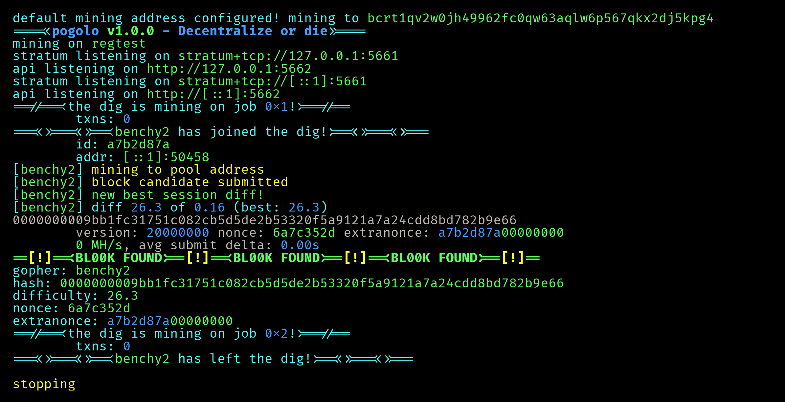

```
/pogolo - decentralize or die/
```

solo db-less bitcoin-only mining pool  
meant for lan swarms, not the internet  
think of this as public-pool but minimal and for self-sovereign nerds  
infinite thanks to btcd for bitcoin tooling and public-pool for reference  
start it, point your miners to it, and watch the logs roll by



*want a go pool you can run on the public internet? check out https://github.com/Distortions81/M45-Core-goPool!*

## features

- up to 4.3-5.2k shares/sec/client
- set a default address to mine to, no more ctrl+c ctrl+v ctrl+v ctrl+v ctrl+v ctrl+v
- btcd websocket support
- colorful and detailed logs (respects NO_COLOR)
- api (see api.go and swagger spec)

## supported BIPs

- 34
- 41 (probably)
- 54
- 310 (minus `subscribe-extranonce`)
- 320

## supported miners

- \*axe family (bitaxe, nerd\*axe, etc)
- cpuminer

## supported backends

pogolo has no tls support.

- JSON-RPC (core, knots, etc)
- btcd websocket

## unsupported

- miners requiring extranonce.subscribe
- luckyminers/other non-foss axe clones
- stratum v2

# setup

## docker

pogolo image at https://hub.docker.com/r/0xf0xx0/pogolo

copy the pogolo.toml from [`contrib/pkgs/docker`](./contrib/pkgs/docker), configure it to your needs, then run

```sh
docker run -d -v "./pogolo.toml:/config/pogolo.toml" 0xf0xx0/pogolo:latest
```

docker (+compose) files exist and work but likely need tweaks, theyre also under [`contrib/pkgs/docker`](./contrib/pkgs/docker)

### environment overrides
for easy config, eg umbrel

```
POGOLO_HOST: # overrides [pogolo].host
POGOLO_BACKEND_HOST: # overrides [backend].host
POGOLO_BACKEND_AUTH: # overrides [backend].rpcauth
```

## go

```sh
go install git.0xf0xx0.eth.limo/0xf0xx0/pogolo@latest
```
then follow [manual install/configure](#configure).

## manual install

### build

```sh
git clone https://git.0xf0xx0.eth.limo/0xf0xx0/pogolo.git
cd pogolo
go build -trimpath -ldflags="-s -w -buildid="
go install
```

### configure

```sh
mkdir "$XDG_CONFIG_HOME/pogolo"
pogolo --writedefaultconf "$XDG_CONFIG_HOME/pogolo/pogolo.toml"
```

or, copy [`contrib/pogolo.example.toml`](./contrib/pogolo.example.toml) to `$XDG_CONFIG_HOME/pogolo/pogolo.toml`  
then configure the interface, backend, and auth

### run

```sh
pogolo
```

## miner config

host: stratum+tcp://<your lan ip>:5661
username: <your onchain address>[.<worker name>]
password: [required if set in pogolo.toml]
suggested diff: [optional]

the onchain address is also optional if the pool has a default configured.

## benchmarking

to reproduce shares/s result:

1. set `benchmark = true` in your config
2. connect with cpuminer (preferably from a different machine) and watch the shares fly

## TODO

- link stratum and mining docs  
    waiting for bip 41  
    https://web.archive.org/web/20201130051808/https://braiins.com/stratum-v1/docs
- completion (urfave is bugged)
- option to add workername to coinbase scriptsig?
- option to ignore empty templates?
- zmq for block notifs?
- when 1.0.0:
    - aur packages (in progress)
